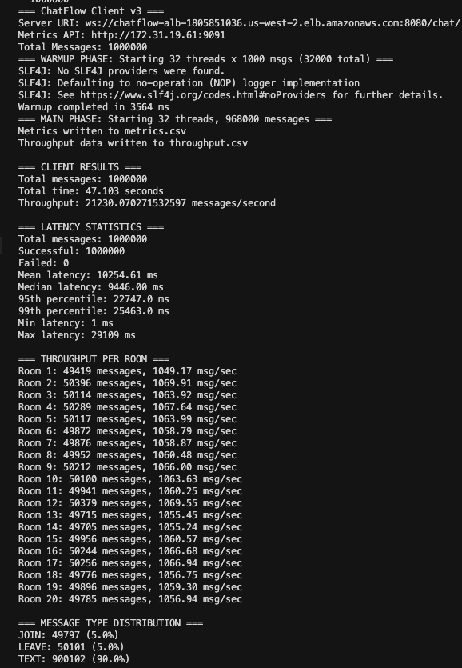
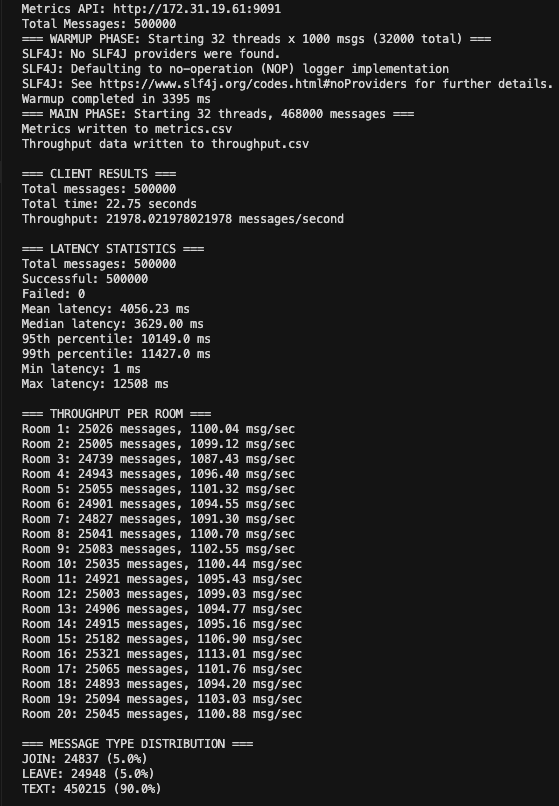
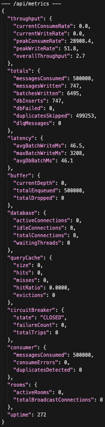
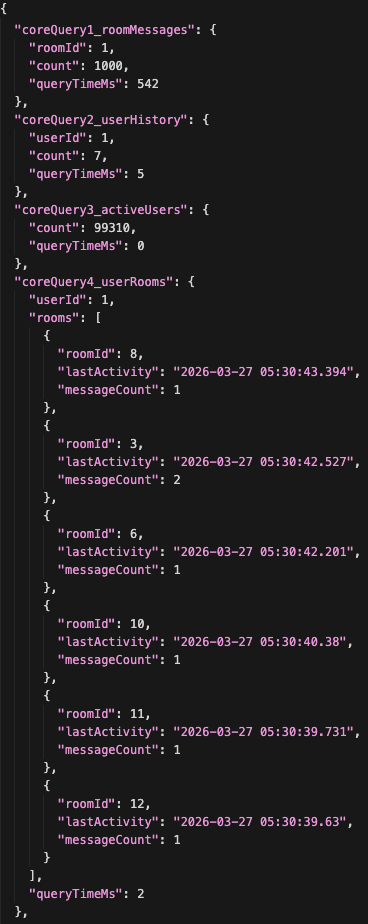
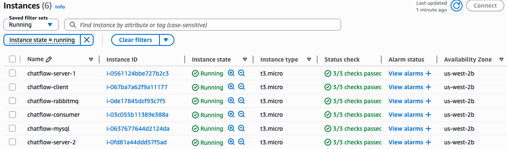

# Architecture

## Overview

ChatFlow is a horizontally-scalable WebSocket chat platform built around four design pillars:

1. **Decoupled producer/consumer** — the gateway publishes to RabbitMQ and forgets; the message processor consumes, persists, and broadcasts on its own clock. Either side can be scaled or restarted independently.
2. **Write-behind persistence** — incoming messages enter an in-memory buffer, then flush to MySQL in adaptive batches. The hot path never blocks on a `db.commit()`.
3. **CQRS read path with L1+L2 caching** — reads bypass the write pipeline, hit a local `ConcurrentHashMap`, fall through to Redis, then to a dedicated reader connection pool against MySQL. Writes invalidate cache keys explicitly on commit.
4. **Fail-open dependencies** — Redis, the circuit breaker, and the dead-letter queue all degrade rather than fail. A Redis outage drops the system to a direct-MySQL read path; a MySQL outage routes failed batches into `dead_letter_messages` for replay.

## Architectural Evolution

The architecture didn't arrive in one shot. Three iterations, each addressing the bottleneck the previous one exposed. Reading this first makes the component diagram below land much faster — every box exists because of a measurement.

**v1 — Echo server, synchronous client.** The proof-of-concept: a single-process WebSocket echo server with no broker, no persistence, no cache. The original client blocked on a per-message `latch.await()` for each response, capping at 7,716 msg/s. Switching from sync `latch.await()` to async callbacks raised throughput 5.8× (7,716 → 43,821 msg/s) and demonstrated that synchronous blocking is the dominant client-side throughput limiter — Little's Law (`λ = L/W`) only binds the sync case. **Carryover into the current system:** per-room WebSocket connection pooling and the 5-field message schema validation.

**v2 — Decoupled producer/consumer over RabbitMQ.** The single server became a stateless producer fleet behind an ALB; a separate consumer service broadcast messages to clients. Added the channel pool, circuit breaker, and batch ACKs (50× fewer AMQP round-trips). Two empirical findings shaped the deployment topology: (a) co-locating RabbitMQ with the consumer cost 26 % of throughput under the same tuning — separating them was the single biggest infrastructure win; (b) removing per-message `waitForConfirms()` was a 7.3× publisher throughput improvement. **Carryover:** the gateway-server module is essentially v2 with renamed packages, the consumer pool's batch-ACK loop, and the channel-pool sizing.

**v3 — Persistence + CQRS.** Added the write-behind pipeline (`WriteBuffer` → `DatabaseWriter` → MySQL), idempotent writes via UUID PK + `INSERT IGNORE`, dead-letter handling, and the read-side cache hierarchy (L1 `ConcurrentHashMap` + L2 Redis with active invalidation). Split connection pools so a write-side circuit-breaker trip doesn't starve reads. Adaptive batch sizing covers both quiet periods (small batches, low latency) and bursts (large batches, high throughput). Summary tables turn analytics queries from 18 M-row `GROUP BY` scans into PK lookups, with the trade-off of row-lock contention that the combined L1+L2 cache neutralizes.

Each layer kept the previous one's invariants. v3 still uses v2's channel pool and circuit breaker; v2 still uses v1's 5-field validation and per-room routing.

## Component Diagram

```
              Clients (WebSocket, ws://)
                       │
                       ▼
         ┌─────────────────────────────┐
         │ Application Load Balancer   │ sticky sessions (LB cookie, 1d), :8080
         │ /health on :8081, 30s int   │
         └──────────────┬──────────────┘
                        │
              ┌─────────┴─────────┐
              ▼                   ▼
       ┌─────────────┐     ┌─────────────┐
       │ gateway-    │     │ gateway-    │   ChatServer.java   (Java-WebSocket)
       │ server #1   │     │ server #2   │   ChannelPool       (10 pre-created AMQP channels)
       │ (:8080)     │     │ (:8080)     │   RabbitMQPublisher (fire-and-forget, async confirms)
       │ /health     │     │ /health     │   CircuitBreaker    (CLOSED→OPEN→HALF_OPEN)
       │ (:8081)     │     │ (:8081)     │
       └──────┬──────┘     └──────┬──────┘
              │                   │
              └─────────┬─────────┘
                        │  AMQP :5672
                        ▼
              ┌────────────────────┐
              │ RabbitMQ           │   chat.exchange (topic, durable)
              │ chat.exchange      │   room.1 .. room.20  (durable, TTL 60s, max-len 100K, drop-head)
              │ room.{1..20}       │
              └─────────┬──────────┘
                        │  AMQP :5672 (basicConsume, prefetch=100)
                        ▼
        ┌──────────────────────────────────┐
        │ message-processor                │   MessageConsumerPool   (4 threads × 5 rooms each)
        │                                  │   WriteBuffer           (BlockingQueue, capacity 500K)
        │                                  │   DatabaseWriter        (3 threads, adaptive batch 500/2K/3K)
        │                                  │   BroadcastServer       (Java-WebSocket fan-out)
        │                                  │   MetricsAPI            (REST, :9091, 11 endpoints)
        │                                  │   QueryCache            (L1, ConcurrentHashMap, TTL 5–60s)
        │                                  │   RedisCacheAdapter     (L2, fail-open Jedis)
        │                                  │   StampedeGuard         (per-key ReentrantLock)
        │                                  │   CircuitBreaker        (writer pool only)
        └──────────────┬─────────────────┬─┘
                       │                 │
                       ▼                 ▼
         ┌──────────────────┐    ┌─────────────────┐
         │ MySQL 8 / InnoDB │    │ Redis 7         │
         │ writer pool ×10  │    │ L2 cache        │
         │ reader pool ×20  │    │ active DEL on   │
         │ 1 GB buffer pool │    │ batch commit    │
         │ summary tables   │    │ fail-open       │
         └──────────────────┘    └─────────────────┘
```

## Modules

### `gateway-server/` — WebSocket entry point and RabbitMQ producer

| Class                                           | Responsibility                                                                                                                                                                                                                                                                |
|-------------------------------------------------|-------------------------------------------------------------------------------------------------------------------------------------------------------------------------------------------------------------------------------------------------------------------------------|
| `Main`                                          | Boot: reads env config, starts WebSocket server on `WS_PORT` and health endpoint on `WS_PORT+1`.                                                                                                                                                                              |
| `ChatServer`                                    | Per-connection handler. Extracts `roomId` from the URL path, validates against the 5-field schema (userId 1–100k, username 3–20 alnum, message 1–500 chars, ISO-8601 timestamp, messageType ∈ {TEXT, JOIN, LEAVE}), enriches with `messageId` (UUID), `serverId`, `clientIp`. |
| `RabbitMQPublisher`                             | Declares `chat.exchange` (topic, durable) + `room.{1..20}`. Publishes with routing key `room.{roomId}` using async confirms (no per-message `waitForConfirms()` — that path was a 7.3× throughput regression).                                                                |
| `ChannelPool`                                   | Thread-safe pool of 10 pre-created channels named `gateway-server-producer`. Avoids per-message channel creation cost.                                                                                                                                                        |
| `CircuitBreaker`                                | Trip threshold 5 failures → OPEN, 15 s reset. Fast-fails publish attempts while broker is unavailable.                                                                                                                                                                        |
| `ChatMessage`, `QueueMessage`, `ServerResponse` | Gson POJOs for incoming wire format, enriched broker payload, and outgoing client response.                                                                                                                                                                                   |

**Stateless by design.** Any gateway instance can serve any room — the ALB's sticky cookie is an optimization for connection reuse, not a correctness requirement.

### `message-processor/` — Consumer pool, write-behind, broadcast, metrics

| Class                 | Responsibility                                                                                                                                                                                                                                                                                                |
|-----------------------|---------------------------------------------------------------------------------------------------------------------------------------------------------------------------------------------------------------------------------------------------------------------------------------------------------------|
| `ConsumerMain`        | Boot: parses `PROFILE` flags (`-Dredis.host`, `-Dsummary.tables`), wires the pipeline, exposes shutdown hook for in-flight drain.                                                                                                                                                                             |
| `MessageConsumerPool` | 4 multiplexed AMQP connections (`message-processor-pool-{0..3}`), each owning 5 of the 20 room queues. Prefetch=100. Forwards raw JSON bytes (no deserialize→re-serialize). Batch ACKs every 50 messages via `multiple=true` (50× fewer AMQP round-trips).                                                    |
| `WriteBuffer`         | `LinkedBlockingQueue<QueueMessage>` of capacity 500K. Producers (consumer threads) push; the database writers pop. Decouples broker drain rate from disk write rate.                                                                                                                                          |
| `DatabaseWriter`      | 3 threads. **Adaptive batch sizing**: queue depth < 5K → 500-row batches; 5K–15K → 2K rows; > 15K → 3K rows. Uses `take()` (blocking) for the first message of a batch to avoid busy-wait CPU lockup, then `drainTo()` for the rest.                                                                          |
| `DatabaseManager`     | Two HikariCP pools — writer (10 connections) and reader (20, `readOnly=true`). On circuit-breaker state transitions, calls `softEvictConnections()` on the writer pool to drop stale connections.                                                                                                             |
| `BroadcastServer`     | Java-WebSocket fan-out. After RabbitMQ delivery, broadcasts the raw JSON to every session subscribed to that `roomId`.                                                                                                                                                                                        |
| `RoomManager`         | Tracks which `WebSocket` sessions are joined to which `roomId`.                                                                                                                                                                                                                                               |
| `MetricsAPI`          | REST on :9091 with 11 endpoints: queue depth, write-buffer fill, batch latency histogram, cache hit-rate, top users (cursor-paginated), recent room messages, dead-letter count, etc. Cursor pagination uses `WHERE timestamp < ?` instead of `LIMIT/OFFSET` and bypasses the cache to prevent key explosion. |
| `QueryCache`          | L1 cache. `ConcurrentHashMap` keyed by query+params with TTL 5–60s depending on endpoint. Exposes `getKnownKeysWithPrefix()` so the writer can target Redis `DEL` precisely on commit.                                                                                                                        |
| `RedisCacheAdapter`   | L2 cache via Jedis. `SETEX` on miss, `DEL`/`deleteBatch` on invalidate. Wraps every call in try/catch — on Redis failure, returns "miss" rather than throwing. Fail-open by design.                                                                                                                           |
| `StampedeGuard`       | Per-key `ReentrantLock` with `tryLock(3s)`. After cache invalidation, the first reader takes the lock, executes the DB query, and refills the cache; concurrent readers on the same key wait for the result. Prevents thundering-herd DB load on hot keys.                                                    |
| `CircuitBreaker`      | Writer-pool guardrail. 5 failures → OPEN, 15 s reset. On state change, evicts the writer pool to clear stale connections. The reader pool is untouched, so the read path keeps serving.                                                                                                                       |
| `BatchResult`         | Honest metric. Distinguishes **attempted** (rows submitted), **inserted** (rows persisted), and **duplicates** (rows skipped by `INSERT IGNORE`). Avoids reporting a duplicate-heavy run as "failed".                                                                                                         |
| `StatsAggregator`     | Periodically rolls up consumer lag (`now - message.timestamp`), batch latency, cache hit rate, queue depth into the metrics endpoints. Logs scaling recommendations every 10 s.                                                                                                                               |

### `database/` — Schema and provisioning

See [Data Model](#data-model) below. `provision-db.sh` is the env-driven IaC entry point: installs MySQL 8 on Amazon Linux 2023, creates the application user, loads `01-init-schema.sql`, and applies production InnoDB tuning (`innodb_buffer_pool_size=1G`, `innodb_flush_log_at_trx_commit=2`, batch-insert tuning, slow-query logging). The schema is squashed — there are no separate migration files; `01-init-schema.sql` represents the complete optimized state including the `messages` core table, `dead_letter_messages` audit, and the two summary tables.

### `deployment/` — EC2 automation

`build-and-deploy.sh` builds all three Maven modules and `scp`s the shaded jars to the right hosts. `run-message-processor.sh` is the runtime entry point — accepts `PROFILE=B0|O1|O2|O12` and translates into JVM flags. `verify-ec2-remote.sh` SSHes into each host and checks process liveness, broker queue depth, MySQL connectivity, and Redis ping. `EC2-DEPLOYMENT-GUIDE.md` is the operator runbook (security groups, ALB target health, MySQL DNS, Redis subnet).

### `load-testing/` — JMeter plans + custom Java client

The Java client is the original write-only load generator: 1 producer thread feeds a 10K-capacity `BlockingQueue`; 32 consumer threads each maintain a per-room `Map<Integer, WebSocketClient>` connection pool, send asynchronously (fire-and-forget), and use a `ConcurrentLinkedQueue<PendingMessage>` for FIFO `sendTimestamp → receiveTimestamp` matching. Failed sends retry up to 5× with exponential backoff (100 / 200 / 400 / 800 / 1600 ms). The JMeter plans cover the 70/30 R/W mix that the custom client doesn't exercise.

### `monitoring/` — Live observability

`monitor.sh` polls `MetricsAPI` every 2 s and prints a compact dashboard (queue depth, writer-pool active, cache hit rate, dead-letter count). `monitor-db.sh` runs `SHOW ENGINE INNODB STATUS` plus a curated set of `performance_schema` queries to surface lock waits, buffer-pool hit rate, and slow queries.

## Data Flow

### Write path

```
WebSocket frame → ChatServer.onMessage()
    → validate (5 fields)
    → enrich (UUID messageId, serverId, clientIp)
    → ChannelPool.borrow() → basicPublish(room.{n}, payload) → release()
    → ack the WebSocket frame
                                                         RabbitMQ
                                                            │
    MessageConsumerPool consumer thread (round-robins 5 rooms)
        → WriteBuffer.put(QueueMessage)            ◀── ACK to broker
        → BroadcastServer.broadcastToRoom(roomId, rawJson)

    DatabaseWriter thread
        → WriteBuffer.take()                        // blocking, first message
        → WriteBuffer.drainTo(batch, capByDepth())  // adaptive 500/2K/3K
        → INSERT IGNORE INTO messages VALUES (...)  // batch
        → ON DUPLICATE KEY UPDATE summary tables    // if PROFILE includes O2
        → QueryCache.invalidate(roomId, userId)     // L1
        → RedisCacheAdapter.deleteBatch(keys)       // L2 active invalidation
```

### Read path

```
HTTP GET /metrics/room/{roomId}/messages?cursor=...
    → MetricsAPI handler
    → QueryCache.get(key)                                    ◀── L1 hit, return
    → RedisCacheAdapter.get(key)                             ◀── L2 hit, fill L1, return
    → StampedeGuard.compute(key, () -> {                     // only one thread per key
          DatabaseManager.reader().query("...WHERE timestamp < ? ORDER BY timestamp DESC LIMIT ?")
      })
    → RedisCacheAdapter.setex(key, ttl)
    → QueryCache.put(key, result)
    → return
```

### Broadcast path

Decoupled from persistence. The consumer ACKs and broadcasts before the row is in MySQL, so a slow disk doesn't slow conversation. If MySQL is down, broadcasts continue and failed batches land in `dead_letter_messages` for replay (when the writer pool's circuit breaker eventually closes).

## Data Model

| Table                  | Purpose                    | Key columns                                                                                                                                                                          | Notes                                                                                                                                                                                                                                                                                                                                                              |
|------------------------|----------------------------|--------------------------------------------------------------------------------------------------------------------------------------------------------------------------------------|--------------------------------------------------------------------------------------------------------------------------------------------------------------------------------------------------------------------------------------------------------------------------------------------------------------------------------------------------------------------|
| `messages`             | Append-only chat log.      | `message_id` CHAR(36) PK (UUID), `room_id` INT, `user_id` INT, `username` VARCHAR(20), `message` VARCHAR(500), `message_type` ENUM, `timestamp` DATETIME(3), `server_id` VARCHAR(64) | Indexed on `(room_id, timestamp)` for cursor pagination and `(user_id, timestamp)` for user history. UUID PK enables `INSERT IGNORE` for idempotent at-least-once writes.                                                                                                                                                                                          |
| `dead_letter_messages` | Failed-write audit.        | `message_id`, `error_reason`, `retry_count`, `original_json`, `failed_at`                                                                                                            | Populated when a batch fails after circuit-breaker exhaustion. Replay tooling reads from here, re-enqueues, and increments `retry_count`.                                                                                                                                                                                                                          |
| `user_message_summary` | Pre-aggregated user stats. | `user_id` PK, `total_messages` BIGINT, `last_active` DATETIME(3)                                                                                                                     | Maintained via `INSERT … ON DUPLICATE KEY UPDATE total_messages = total_messages + VALUES(total_messages)` per batch. Turns a 18 M-row `GROUP BY user_id` into an O(1) PK lookup. Trade-off: row-lock contention under bulk writes (observed ~13 min into the 60 min E1 endurance run with profile O2 alone — combining with O1 / Redis amortizes the contention). |
| `room_message_summary` | Pre-aggregated room stats. | `room_id` PK, `total_messages`, `last_active`                                                                                                                                        | Same pattern as `user_message_summary`.                                                                                                                                                                                                                                                                                                                            |

**Write tuning:**
- `INSERT IGNORE` + UUID PK → duplicates from at-least-once delivery silently dropped.
- `rewriteBatchedStatements=true` → JDBC rewrites the prepared batch into a single multi-value INSERT.
- `innodb_flush_log_at_trx_commit=2` → flush every ~1 s, trading 1 s of durability for ~3× write throughput.
- `innodb_buffer_pool_size=1 GB` → keeps the working set of indexes resident, eliminating disk thrashing observed at 500 K+ rows.

**Read tuning:**
- Cursor pagination (`WHERE timestamp < ? ORDER BY timestamp DESC LIMIT ?`) instead of `LIMIT/OFFSET` — avoids `OFFSET=N` scans on a hot index and prevents cache key explosion.
- Reader pool marked `readOnly=true` so MySQL skips redo-log work for those connections.

## Resilience

| Pattern                | Implementation                                 | Guarantee                                                                                                                                                                            |
|------------------------|------------------------------------------------|--------------------------------------------------------------------------------------------------------------------------------------------------------------------------------------|
| Circuit breaker        | `CircuitBreaker.java`, both modules            | 5 consecutive failures → OPEN for 15 s → HALF_OPEN probe → CLOSED on success. On state transition, the writer-pool variant calls `softEvictConnections()` to drop stale connections. |
| Dead-letter queue      | `dead_letter_messages` table                   | Failed batch rows persist with original JSON. Replay tool re-enqueues to RabbitMQ.                                                                                                   |
| Idempotent writes      | UUID PK + `INSERT IGNORE`                      | At-least-once delivery → exactly-once persistence. Tested by replaying duplicate batches.                                                                                            |
| Cache stampede guard   | `StampedeGuard.java`                           | At most 1 DB query per key per invalidation cycle, regardless of concurrent reader count.                                                                                            |
| Split connection pools | HikariCP writer (10) + reader (20, `readOnly`) | Read path is unaffected by writer-side circuit-breaker trips.                                                                                                                        |
| Fail-open Redis        | `RedisCacheAdapter.java`                       | Redis exception → treated as cache miss → falls through to MySQL. Never propagates a 5xx.                                                                                            |
| Active invalidation    | `Redis DEL` on batch commit                    | Bounds stale-read window to (commit latency + L1 TTL), independent of L2 TTL.                                                                                                        |
| Adaptive batch sizing  | `DatabaseWriter` queue-depth lookup            | Avoids both small-batch overhead at low load and large-batch latency spikes during burst.                                                                                            |

## Performance Characteristics

### Write-only baseline (custom Java client, 32 threads)

| Test      | Messages    | Throughput       | Persistence | Notes                                                                           |
|-----------|-------------|------------------|-------------|---------------------------------------------------------------------------------|
| Baseline  | 500,000     | 19,687 msg/s     | 100 %       | Steady state, batch latency ~36 ms                                              |
| Stress    | 1,000,000   | 21,091 msg/s     | 99.98 %     | 232 dropped from client resource exhaustion at the 51 s mark                    |
| Endurance | 5 × 500,000 | 20,521 msg/s avg | 100 %       | Batch latency drift: R1=35.6 ms, R5=432.1 ms (InnoDB index maintenance scaling) |



### Mixed read/write (JMeter, 70/30)

| Scenario                 | Profile | Samples    | RPS    | Avg latency | Notes                                                                |
|--------------------------|---------|------------|--------|-------------|----------------------------------------------------------------------|
| S2 — 30 min, 500 threads | B0      | 18,304,635 | 10,158 | 37 ms       | Baseline; tail driven by 15 s `GROUP BY` spikes                      |
| S2 — 30 min, 500 threads | O2      | 19,866,386 | 11,021 | 32 ms       | Summary tables eliminate the GROUP BY                                |
| S2 — 30 min, 500 threads | O12     | 17,898,138 | 9,930  | 37 ms       | Combined Redis + summary; lower RPS than O2 alone but lower variance |
| E1 — 60 min, 50 threads  | B0      | 112,547    | 52     | 949 ms      | 5.77 % errors, periodic 15 s timeout spikes                          |
| E1 — 60 min, 50 threads  | O2      | 48,478     | 13.5   | 3,718 ms    | 19.47 % errors, summary-table row-lock contention at ~13 min         |
| E1 — 60 min, 50 threads  | O12     | 120,311    | 33     | 1,495 ms    | 9.41 % errors, **survived full hour** — best resilience              |





### Core read queries at 1 M rows

| Query                          | Target   | Measured |
|--------------------------------|----------|----------|
| Q1 — Recent room messages      | < 100 ms | 13 ms    |
| Q2 — User message history      | < 200 ms | 2 ms     |
| Q3 — Active users (last 5 min) | < 500 ms | < 1 ms   |
| Q4 — Rooms a user has joined   | < 50 ms  | 2 ms     |



## Operations

**Profiles** (set via `PROFILE=` env var, expanded by `run-message-processor.sh` into JVM flags):

| Profile | Flags                   | What's active                       | When to use                                   |
|---------|-------------------------|-------------------------------------|-----------------------------------------------|
| B0      | none                    | Direct MySQL, no caching            | Baseline / debugging                          |
| O1      | `-Dredis.host=…`        | L1 + L2 cache + active invalidation | Read-heavy mix, latency-sensitive             |
| O2      | `-Dsummary.tables=true` | Pre-aggregated summary tables       | Analytics-heavy reads, short bursts           |
| O12     | both                    | Combined                            | Production default — best long-run resilience |

**Scaling axes:**
- Gateway: stateless, scale by adding ALB targets. Single t3.micro caps at ~17 k msg/s on its own.
- Broker: vertical only (RabbitMQ on its own instance). Co-locating broker + consumer dropped throughput 26 % under tuning.
- Processor: vertical (more consumer threads, larger writer pool). Horizontal scaling requires partitioning rooms across processors — not yet implemented.
- MySQL: vertical (t3.small with 1 GB buffer pool comfortably handles 21 k msg/s sustained); read replicas would scale the read path further.
- Redis: dedicated instance, fail-open, sized to fit the working set of `room_message_summary` × TTL.

**Production footprint** (reference deployment):
| Instance | Type | Role |
| --- | --- | --- |
| gateway × 2 | t3.micro | WebSocket front + ALB targets |
| RabbitMQ | t3.micro | Message broker |
| message-processor | t3.micro | Consumer + persister + broadcaster |
| MySQL | t3.small | InnoDB, 1 GB buffer pool, T3 Unlimited |
| Redis | t3.micro | L2 cache, fail-open |
| client | t3.small | JMeter / custom load test driver |



All in `us-west-2b`, Amazon Linux 2023, Java Corretto 11, MySQL 8.x, RabbitMQ 4.x, Redis 7.x.
